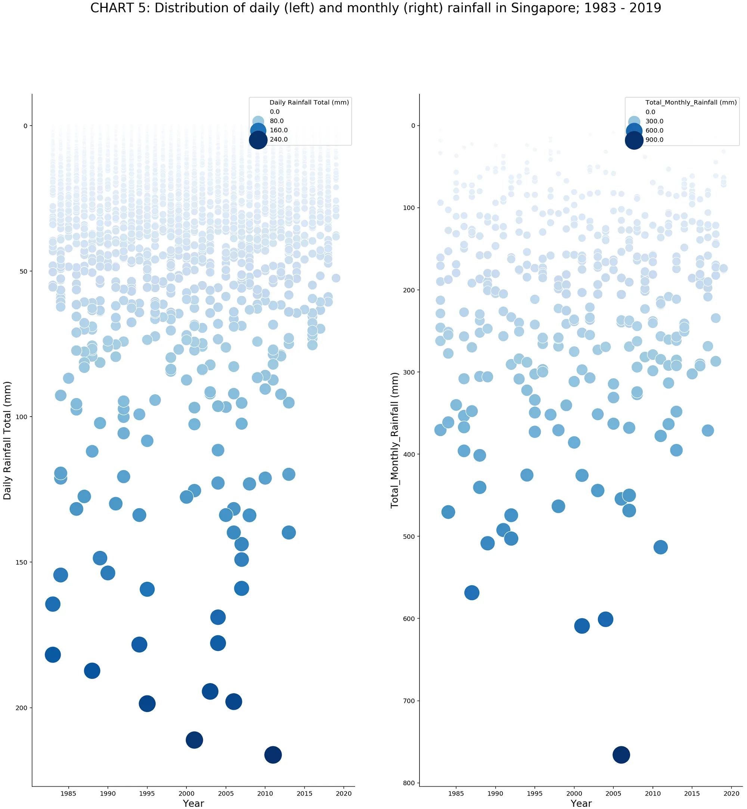

## Introduction

Exploratory data analysis of the rainfall data from the Changi station for Week 09 mid-project check in

```{r}
#| label: setup

library(dplyr)
library(ggplot2)
library(lubridate)
library(janitor)
library(tibble)
library(tidyr)
library(stringr)
library(viridis)
library(patchwork)
library(scales)
library(ggrepel)
library(zoo)

```

## Data Loading and Cleaning

We scraped the online database for data from Changi station that covers 1980-2026. 
For the main comparison dataset, this analysis uses 1983 onward. 
This matches the starting year of the reference Medium
visualisation, while still extending the time period beyond the original 1983-2019
range using the newer records available up to 2026, 
and also 1980 to 1982 has many blank data which we removed.

The 1980-1982 records are not deleted from the raw source file. Instead, they are
cleaned first, checked for missingness, and then excluded from the main analysis
dataset. This makes the cleaning decision reproducible in R rather than relying on
manual spreadsheet edits.

```{r}
#| label: load-and-clean-data

# Create directories for processed data and figures
dir.create("data/processed", showWarnings = FALSE, recursive = TRUE)
dir.create("figures", showWarnings = FALSE, recursive = TRUE)

# Define a function to parse numbers from character vectors
parse_base_number <- function(x) {
  cleaned <- gsub("[^0-9.\\-]+", "", as.character(x))
  cleaned[cleaned == ""] <- NA_character_
  suppressWarnings(as.numeric(cleaned))
}

# Find the CSV file
csv_path <- "MSS_Master_Daily_S24_1980_2026.csv"
if (!file.exists(csv_path)) {
  csv_path <- file.path("data", "raw", "MSS_Master_Daily_S24_1980_2026.csv")
}
if (!file.exists(csv_path)) {
  stop("Could not find MSS_Master_Daily_S24_1980_2026.csv")
}

# Read and clean the raw data
rainfall_raw <- read.csv(
  csv_path,
  na.strings = c("", "NA", "N/A", "-", "\u2014", "\u0097"),
  fileEncoding = "UTF-8",
  stringsAsFactors = FALSE,
  check.names = FALSE
)

rainfall_all <- rainfall_raw |>
  janitor::clean_names() |>
  mutate(
    across(c(year, month, day), as.integer),
    date = lubridate::make_date(year = year, month = month, day = day),
    across(
      c(
        daily_rainfall_total_mm,
        highest_30_min_rainfall_mm,
        highest_60_min_rainfall_mm,
        highest_120_min_rainfall_mm,
        mean_temperature_c,
        maximum_temperature_c,
        minimum_temperature_c,
        mean_wind_speed_km_h,
        max_wind_speed_km_h
      ),
      parse_base_number
    ),
    station = stringr::str_squish(station)
  ) |>
  arrange(date)

early_year_missingness <- rainfall_all |>
  filter(year >= 1980, year <= 1985) |>
  group_by(year) |>
  summarise(
    rows = n(),
    daily_rainfall_missing_percent = mean(is.na(daily_rainfall_total_mm)),
    highest_30_min_missing_percent = mean(is.na(highest_30_min_rainfall_mm)),
    highest_60_min_missing_percent = mean(is.na(highest_60_min_rainfall_mm)),
    highest_120_min_missing_percent = mean(is.na(highest_120_min_rainfall_mm)),
    temperature_fields_missing_percent = mean(
      is.na(mean_temperature_c) |
        is.na(maximum_temperature_c) |
        is.na(minimum_temperature_c)
    ),
    wind_fields_missing_percent = mean(
      is.na(mean_wind_speed_km_h) |
        is.na(max_wind_speed_km_h)
    ),
    .groups = "drop"
  )

print(early_year_missingness)

# Main comparison dataset:
# 1980-1982 are excluded because these years contain substantial missingness in
# supporting weather/intensity fields and the reference visualisation begins in
# 1983. Daily rainfall itself is complete in these years, so this is a design
# comparability decision rather than a claim that the rainfall totals are absent.
rainfall <- rainfall_all |>
  filter(year >= 1983, year <= 2026)

```

## Data Quality Checks

Here we perform some basic checks on the cleaned data to understand its integrity.

```{r}
#| label: data-quality-checks

date_checks <- tibble(
  check = c(
    "rows",
    "first_date",
    "last_date",
    "invalid_dates",
    "duplicate_dates",
    "missing_dates_inside_observed_range",
    "missing_daily_rainfall_values",
    "negative_daily_rainfall_values"
  ),
  value = c(
    as.character(nrow(rainfall)),
    as.character(min(rainfall$date, na.rm = TRUE)),
    as.character(max(rainfall$date, na.rm = TRUE)),
    as.character(sum(is.na(rainfall$date))),
    as.character(sum(duplicated(rainfall$date))),
    as.character(length(setdiff(
      seq(min(rainfall$date, na.rm = TRUE), max(rainfall$date, na.rm = TRUE), by = "day"),
      rainfall$date
    ))),
    as.character(sum(is.na(rainfall$daily_rainfall_total_mm))),
    as.character(sum(rainfall$daily_rainfall_total_mm < 0, na.rm = TRUE))
  )
)

print(date_checks)

field_missingness <- rainfall |>
  summarise(across(everything(), ~ sum(is.na(.x)))) |>
  pivot_longer(
    cols = everything(),
    names_to = "column",
    values_to = "missing_values"
  ) |>
  mutate(missing_percent = missing_values / nrow(rainfall))

print(field_missingness)
```

## Data Aggregation
We will aggregate the daily data into monthly and yearly summaries so that we can understand the data at different resolutions
```{r}
#| label: aggregate-data

monthly_observed <- rainfall |>
  mutate(month_start = floor_date(date, unit = "month")) |>
  group_by(year, month, month_start) |>
  summarise(
    monthly_total_mm = sum(daily_rainfall_total_mm, na.rm = TRUE),
    n_days_observed = n(),
    n_missing_rainfall = sum(is.na(daily_rainfall_total_mm)),
    expected_days = lubridate::days_in_month(first(month_start)),
    .groups = "drop"
  ) |>
  mutate(
    month_status = case_when(
      n_days_observed == expected_days & n_missing_rainfall == 0 ~ "complete",
      TRUE ~ "partial"
    )
  )

all_months <- tidyr::expand_grid(
  year = min(rainfall$year, na.rm = TRUE):max(rainfall$year, na.rm = TRUE),
  month = 1:12
) |>
  mutate(
    month_start = lubridate::make_date(year, month, 1),
    expected_days = lubridate::days_in_month(month_start)
  )

monthly <- all_months |>
  left_join(
    monthly_observed,
    by = c("year", "month", "month_start", "expected_days")
  ) |>
  mutate(
    month_status = case_when(
      is.na(n_days_observed) ~ "unavailable",
      month_status == "complete" ~ "complete",
      TRUE ~ "partial"
    ),
    month_name = factor(month.abb[month], levels = month.abb),
    year_display = factor(year, levels = rev(sort(unique(year)))),
    display_total_mm = if_else(month_status == "complete", monthly_total_mm, NA_real_)
  )

annual <- monthly |>
  group_by(year) |>
  summarise(
    observed_total_mm = sum(monthly_total_mm, na.rm = TRUE),
    complete_months = sum(month_status == "complete"),
    unavailable_months = sum(month_status == "unavailable"),
    partial_months = sum(month_status == "partial"),
    annual_total_mm = if_else(
      complete_months == 12,
      observed_total_mm,
      NA_real_
    ),
    year_status = if_else(complete_months == 12, "complete", "partial_or_unavailable"),
    .groups = "drop"
  )

# Displaying the first few rows of the aggregated data
print("Monthly Data Head:")
head(monthly)

print("Annual Data Head:")
head(annual)
```

## Save Processed Data

The cleaned and aggregated data are saved to CSV files. This fulfills the requirement to provide the dataset in its cleaned form.

```{r}
#| label: save-processed-data

write.csv(rainfall_all, file.path("data", "processed", "changi_daily_cleaned_full_1980_2026.csv"), row.names = FALSE, na = "")
write.csv(rainfall, file.path("data", "processed", "changi_daily_cleaned.csv"), row.names = FALSE, na = "")
write.csv(monthly, file.path("data", "processed", "changi_monthly_rainfall.csv"), row.names = FALSE, na = "")
write.csv(annual, file.path("data", "processed", "changi_annual_rainfall.csv"), row.names = FALSE, na = "")

```

---

## Design Brief Draft



This project redesigns Chart 5 from *Visualising Singapore's Changing Weather
Patterns (1983-2019)*, which compares daily and monthly rainfall in Singapore.
The original chart is visually memorable because it uses falling rain-like
circles to highlight extreme rainfall events, but it is difficult to read due to
overplotting, repeated encodings of rainfall amount, a reversed y-axis, and
limited interactivity. Our redesign aims to make long-term rainfall patterns
clearer by reducing visual clutter, improving comparison across years and
rainfall levels, and extending the dataset from 1983 to 2026. The intended
audience includes students, Singapore residents, planners, and policymakers
interested in rainfall trends and extreme weather events.

---

## Planned Design Direction

(TODO: Add your 1-2 paragraph note on your planned design direction and any questions for the instructors here.)

For the daily rainfall chart, we plan to replace the current visualisation with a stacked bar chart that groups each day into rainfall ranges: 0–50 mm, 50–100 mm, and 100–200 mm. Each range will be represented by a distinct colour, and the y-axis will show the frequency of days with rain within each range over the course of a year, with each bar totalling 365 days. The x-axis will represent each year, making it easy to compare how the distribution of rainfall intensity has shifted over time. If this approach becomes too granular, we will scale up to monthly aggregates instead

For the monthly rainfall chart, each bar will represent a full year on the x-axis broken down into 12 segments one per month arranged from January to December and colour-coded accordingly. The y-axis will show total rainfall, allowing readers to see not just annual totals but also how rainfall is spread across months within each year. This makes it straightforward to identify seasonal patterns and track how individual months trend over the full 1983–2026 period.

---

## Questions

---
