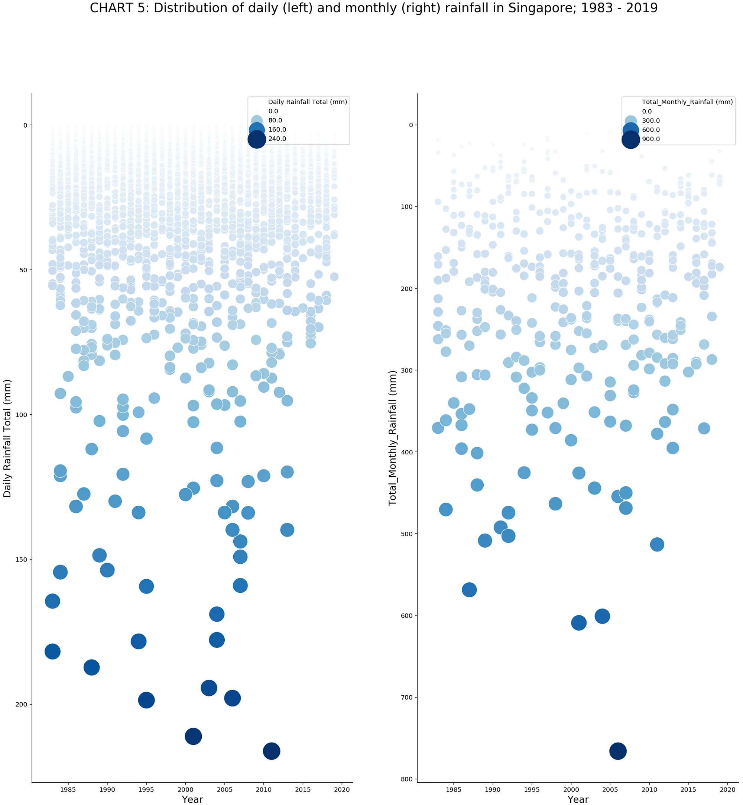

```{r}
#| label: setup
#| message: false
library(tidyverse)
library(lubridate)
library(janitor)

knitr::opts_chunk$set(
  fig.align = "center",
  out.width = "100%",
  dpi = 160
)
```

## 1 Project Overview

This project redesigns a published rainfall visualisation using historical daily rainfall observations for Singapore. The submitted raw data cover January 1980 through May 2026. The redesign retains 1983 as the starting year for comparison with the original article, extends the record through the latest complete year in the dataset, 2025, and excludes the incomplete 2026 record.

| Item | Description |
|---|---|
| Original chart | Chart 5: Daily and monthly rainfall distributions in Singapore, 1983--2019 |
| Redesign objective | Help drainage-planning teams identify months and years containing repeated high-rainfall days |
| Analysis period | 1983--2025, using complete calendar years |
| Data source | Meteorological Service Singapore Historical Daily Records |
| Raw input | `MSS_Master_Daily_S24_1980_2026.csv` |
| Variables used | Date fields and daily rainfall total; station labels are used only for metadata validation |
| Final visualisation | Year-month matrix in which tile colour shows the monthly count of days with at least 50 mm of rainfall and orange markers show the count of days with at least 100 mm |

### 1.1 Original Visualisation and Critique

The original Chart 5 in *Visualising Singapore's Changing Weather Patterns: 1983–2019* by Chua Chin Hon was designed to show the distribution of daily (left) and monthly (right) rainfall. It plotted daily observations and monthly totals chronologically in adjacent scatterplots. Each panel used its own inverted *y*-axis, while rainfall amount was also mapped to point size and colour intensity.

{#fig-original-rainfall fig-alt="Two adjacent chronological scatterplots show daily rainfall on the left and monthly rainfall on the right. Both vertical axes are inverted, and larger, darker blue circles represent higher rainfall amounts."}

*Source: Chua, Chin Hon. (2019, August 11). ["Visualising Singapore's Changing Weather Patterns: 1983–2019"](https://medium.com/data-science/visualising-singapores-changing-weather-patterns-1983-2019-a78605fadbdf), Chart 5. Towards Data Science.*

Notable strengths of the original visualisation include:

1.  **Chronological Historical Overview:** Both panels arrange years from left to right, allowing readers to scan several decades of rainfall records within one view.
2.  **Visibility of High-Rainfall Observations:** Larger and darker points make unusually high daily and monthly rainfall observations visually salient.
3.  **Daily and Monthly Perspectives:** Placing daily observations beside monthly totals gives readers two levels of temporal detail.

The original also uses deliberate visual features that create usability trade-offs and opportunities for improvement:

1.  **Thematic but Unconventional Axis Direction:** The inverted axes make rainfall appear to fall down the page. Although this metaphor relates visually to the subject, larger quantitative values conventionally appear higher on an axis. Readers must therefore override a familiar mapping, which may increase interpretation effort.
2.  **Overplotting and Noise:** Daily rainfall is highly skewed, and many observations have little or no rain. Plotting more than 13,000 daily observations produces a dense region of overlapping points that makes individual observations and broader seasonal patterns difficult to distinguish.
3.  **Different Scales Complicate Comparison:** The daily and monthly panels use separate vertical scales, approximately 0--225 mm and 0--800 mm respectively. Similar vertical positions therefore do not represent comparable rainfall amounts across the two panels, so readers must inspect both axes carefully.
4.  **Redundant Channel Mapping:** Rainfall amount is encoded through vertical position, colour intensity, and point size. This redundancy helps emphasize large observations but also increases visual complexity.
5.  **Limited Month-by-Year Comparison:** The chronological scatterplots do not make it easy to compare the same calendar month across years or identify recurring seasonal concentrations of high-rainfall days.

### 1.2 Design Brief

This redesign is intended for drainage-planning teams conducting preliminary reviews of historical rainfall in Singapore. It helps them identify which months and years contained repeated high-rainfall days, so they can select periods that warrant deeper station, catchment, and flood-impact analysis. The year-month matrix supports rapid seasonal comparison: colour shows the number of days with at least 50 mm of rain, while orange circles mark the number with at least 100 mm. These project-defined cut-offs describe uncommon and very uncommon rainfall days; they are not official flood-warning or engineering thresholds.

*Main revisions:*

- **Year-Month Matrix Layout** to preserve both the long-term record and month-by-month seasonality in one view.
- **Rainfall-Day Classes** to encode the monthly count of days with at least 50 mm of rainfall.
- **High-Rainfall Markers** to flag days with at least 100 mm of rainfall without hiding the count represented by tile colour.
- **Comparable Analysis Period** to retain the original article's 1983 starting year, extend the record through 2025, and exclude the incomplete 2026 record.

------------------------------------------------------------------------

## 2 Import the Rainfall Data

The raw CSV comes from the [Meteorological Service Singapore Historical Daily Records](https://www.weather.gov.sg/climate-historical-daily/). Each row represents one calendar-day observation and contains the station label; separate year, month, and day fields; daily rainfall total; highest 30-, 60-, and 120-minute rainfall; mean, maximum, and minimum temperature; and mean and maximum wind speed. This redesign uses the date fields, station label, and daily rainfall total. The submitted `data/MSS_Master_Daily_S24_1980_2026.csv` is the pipeline's raw input; the cleaning code reads this file and writes a separate processed file without overwriting it.

The code below identifies the project root by checking the supported CSV locations, including the submitted `data/` directory, and then reads the first matching file. This avoids relying on a hidden version-control directory that would not be present in the submitted ZIP archive.

```{r}
#| label: import-rainfall-data
find_project_root <- function(start_dir = getwd()) {
  current_dir <- normalizePath(start_dir, winslash = "/", mustWork = TRUE)

  repeat {
    source_csv_candidates <- c(
      file.path(current_dir, "MSS_Master_Daily_S24_1980_2026.csv"),
      file.path(current_dir, "data", "MSS_Master_Daily_S24_1980_2026.csv"),
      file.path(
        current_dir,
        "data",
        "raw",
        "MSS_Master_Daily_S24_1980_2026.csv"
      )
    )

    if (any(file.exists(source_csv_candidates))) {
      return(current_dir)
    }

    parent_dir <- dirname(current_dir)

    if (identical(parent_dir, current_dir)) {
      stop(
        "Could not find the project root. Run this report from the project folder or a subfolder.",
        call. = FALSE
      )
    }

    current_dir <- parent_dir
  }
}

project_root <- find_project_root()

csv_candidates <- c(
  file.path(project_root, "MSS_Master_Daily_S24_1980_2026.csv"),
  file.path(project_root, "data", "MSS_Master_Daily_S24_1980_2026.csv"),
  file.path(project_root, "data", "raw", "MSS_Master_Daily_S24_1980_2026.csv")
)

csv_path <- csv_candidates[file.exists(csv_candidates)][1]

if (is.na(csv_path)) {
  stop(
    paste(
      "Could not find MSS_Master_Daily_S24_1980_2026.csv",
      "in the project root, data/, or data/raw/."
    ),
    call. = FALSE
  )
}

rainfall_raw <- read_csv(
  csv_path,
  na = c("", "NA", "N/A", "-", "\u2014", "\u0097"),
  show_col_types = FALSE
)

rainfall_raw
```

------------------------------------------------------------------------

## 3 Clean the Rainfall Data

The raw file stores date information across separate year, month, and day columns. We clean the column names, convert the date fields to integers, create a proper `date` column, parse rainfall as a numeric variable, and trim whitespace from the station name.

```{r}
#| label: clean-rainfall-data
rainfall <- rainfall_raw |>
  clean_names() |>
  mutate(
    across(c(year, month, day), as.integer),
    date = make_date(year = year, month = month, day = day),
    daily_rainfall_total_mm = suppressWarnings(
      parse_double(
        as.character(daily_rainfall_total_mm),
        na = c("", "NA", "N/A", "-", "\u2014", "\u0097"),
        trim_ws = TRUE
      )
    ),
    station = str_squish(station),
    month_name = factor(month.abb[month], levels = month.abb)
  ) |>
  arrange(date)

head(rainfall)
tail(rainfall)
```

### 3.1 Verify the Cleaned Data

These checks confirm the observed date range, duplicate dates, missing dates, missing rainfall values, and impossible negative rainfall values.

```{r}
#| label: verify-rainfall-cleaning
date_checks <- tibble(
  check = c(
    "rows",
    "first_date",
    "last_date",
    "invalid_dates",
    "duplicate_dates",
    "missing_dates_inside_observed_range",
    "missing_daily_rainfall_values",
    "negative_daily_rainfall_values"
  ),
  value = c(
    as.character(nrow(rainfall)),
    as.character(min(rainfall$date, na.rm = TRUE)),
    as.character(max(rainfall$date, na.rm = TRUE)),
    as.character(sum(is.na(rainfall$date))),
    as.character(sum(duplicated(rainfall$date))),
    as.character(length(setdiff(
      seq(
        min(rainfall$date, na.rm = TRUE),
        max(rainfall$date, na.rm = TRUE),
        by = "day"
      ),
      rainfall$date
    ))),
    as.character(sum(is.na(rainfall$daily_rainfall_total_mm))),
    as.character(sum(rainfall$daily_rainfall_total_mm < 0, na.rm = TRUE))
  )
)

date_checks
```

```{r}
#| label: verify-station-history
station_history <- rainfall |>
  group_by(station) |>
  summarise(
    first_date = min(date),
    last_date = max(date),
    n_days = n(),
    .groups = "drop"
  ) |>
  arrange(first_date)

station_change_dates <- rainfall |>
  mutate(previous_station = lag(station)) |>
  filter(!is.na(previous_station), station != previous_station) |>
  select(date, previous_station, station)

station_history
station_change_dates
```

The station history check identifies one metadata-label change on 1 February 2026, after the 1983--2025 analysis period; it therefore does not affect the redesigned visualisation.

### 3.2 Export the Cleaned Daily Data

We write the cleaned daily dataset to `data/processed/` to ensure project reproducibility.

```{r}
#| label: export-cleaned-rainfall-data
dir.create(
  file.path(project_root, "data", "processed"),
  showWarnings = FALSE,
  recursive = TRUE
)

write_csv(
  rainfall,
  file.path(project_root, "data", "processed", "changi_daily_cleaned.csv")
)
```

------------------------------------------------------------------------

## 4 Define and Summarise the Rainfall Cut-Offs

The redesign uses two daily rainfall cut-offs rather than monthly rainfall totals: at least 50 mm and at least 100 mm in one day. We restrict the analysis to 1983--2025, retaining the original article's starting year and excluding the incomplete 2026 record.

Meteorological Service Singapore identifies 50 mm of rainfall within one hour as a criterion used for issuing heavy-rain warnings ([MSS Research Letters, Issue 2, p. 36](https://ccrs.weather.gov.sg/wp-content/uploads/2019/02/MRL_Issue_2_Dec2018_FINAL.pdf)). The historical dataset used in this project does not contain complete 60-minute rainfall measurements across the full 1983--2025 period, so that operational criterion cannot be applied consistently. We therefore use a daily total of at least 50 mm as a conservative screening cut-off. Any occurrence of 50 mm within one hour would necessarily produce a daily total of at least 50 mm, although the daily cut-off may also include rainfall accumulated over several hours. It should therefore not be interpreted as confirmation that the official hourly warning criterion was met. The official source describes 50 mm per hour as a warning issuance criterion, not a general definition of every "heavy-rain day."

```{r}
#| label: summarise-selected-rainfall-thresholds
daily_analysis_period <- rainfall |>
  mutate(
    date = as.Date(date),
    year = as.integer(year),
    month = as.integer(month),
    daily_rainfall_total_mm = as.numeric(daily_rainfall_total_mm)
  ) |>
  filter(
    year >= 1983,
    year <= 2025
  )

analysis_input_missing_counts <- daily_analysis_period |>
  summarise(
    missing_dates = sum(is.na(date)),
    missing_month_values = sum(is.na(month)),
    missing_daily_rainfall_values = sum(is.na(daily_rainfall_total_mm))
  )

if (any(unlist(analysis_input_missing_counts) > 0)) {
  stop(
    paste(
      "The 1983-2025 analysis period contains missing required values.",
      "Resolve them before calculating rainfall-threshold counts."
    ),
    call. = FALSE
  )
}

analysis_input_missing_counts

threshold_prevalence <- daily_analysis_period |>
  summarise(
    total_days = sum(!is.na(daily_rainfall_total_mm)),
    days_50_plus = sum(daily_rainfall_total_mm >= 50, na.rm = TRUE),
    proportion_50_plus = days_50_plus / total_days,
    days_100_plus = sum(daily_rainfall_total_mm >= 100, na.rm = TRUE),
    proportion_100_plus = days_100_plus / total_days
  )

monthly_threshold_summary <- daily_analysis_period |>
  mutate(
    month_name = factor(month.abb[month], levels = month.abb)
  ) |>
  group_by(month, month_name) |>
  summarise(
    days_50_plus = sum(
      daily_rainfall_total_mm >= 50,
      na.rm = TRUE
    ),
    days_100_plus = sum(
      daily_rainfall_total_mm >= 100,
      na.rm = TRUE
    ),
    years_with_50_plus = n_distinct(
      year[daily_rainfall_total_mm >= 50]
    ),
    years_with_100_plus = n_distinct(
      year[daily_rainfall_total_mm >= 100]
    ),
    .groups = "drop"
  ) |>
  arrange(month)

monthly_threshold_summary |>
  select(
    month_name,
    days_50_plus,
    days_100_plus,
    years_with_50_plus,
    years_with_100_plus
  ) |>
  knitr::kable(
    col.names = c(
      "Month",
      "Days >=50 mm",
      "Days >=100 mm",
      "Years with >=50 mm",
      "Years with >=100 mm"
    ),
    caption = "Calendar-month rainfall-threshold summary for Singapore, 1983--2025."
  )
```

Across the `r threshold_prevalence$total_days` daily observations in the analysis period, `r threshold_prevalence$days_50_plus` days (`r sprintf("%.2f%%", 100 * threshold_prevalence$proportion_50_plus)`) recorded at least 50 mm of rainfall and `r threshold_prevalence$days_100_plus` days (`r sprintf("%.2f%%", 100 * threshold_prevalence$proportion_100_plus)`) recorded at least 100 mm. The cut-offs therefore distinguish uncommon from very uncommon high-rainfall days while retaining interpretable month-year counts. The calendar-month summary above provides a numerical companion to the visual patterns in Section 5.

The 100 mm daily cut-off remains a project-defined category used to distinguish the most uncommon daily totals. It represents approximately `r sprintf("%.2f%%", 100 * threshold_prevalence$proportion_100_plus)` of observations in the analysis period and is not an official warning or engineering threshold.

------------------------------------------------------------------------

## 5 Redesigned Visualisation

This is the primary redesign chart for drainage-planning teams conducting a preliminary historical review of rainfall in Singapore. Each column is one year and each row is one calendar month. Every cell in the grid covers one month in one year across the complete 1983--2025 analysis period.

Tile colour encodes the number of days with at least 50 mm of rainfall in each month-year using a five-level discrete scale: 0 days (near-white), 1 day (light blue), 2 days (medium blue), 3 days (dark blue), and 4 or more days (deep blue). Orange circle markers appear over cells that contained at least one day with 100 mm or more; circle size represents the number of such days in that cell.

The two encodings keep seasonal concentrations and uncommon high-rainfall observations visible without implying that rainfall totals directly measure flooding or drainage performance.

```{r}
#| label: prepare-year-month-heavy-rain-matrix

daily_matrix_input_checks <- daily_analysis_period |>
  summarise(
    first_date = min(date),
    last_date = max(date),
    n_years = n_distinct(year),
    n_days = n(),
    missing_month_values = sum(is.na(month)),
    missing_daily_rainfall_values = sum(is.na(daily_rainfall_total_mm))
  )

year_month_heavy_rain <- daily_analysis_period |>
  mutate(
    month_name = factor(month.abb[month], levels = rev(month.abb))
  ) |>
  group_by(year, month, month_name) |>
  summarise(
    days_50_to_99 = sum(
      daily_rainfall_total_mm >= 50 &
        daily_rainfall_total_mm < 100,
      na.rm = TRUE
    ),
    days_100_plus = sum(
      daily_rainfall_total_mm >= 100,
      na.rm = TRUE
    ),
    days_50_plus = days_50_to_99 + days_100_plus,
    max_daily_mm = max(daily_rainfall_total_mm, na.rm = TRUE),
    .groups = "drop"
  ) |>
  mutate(
    rainfall_day_class = case_when(
      days_50_plus == 0 ~ "0",
      days_50_plus == 1 ~ "1",
      days_50_plus == 2 ~ "2",
      days_50_plus == 3 ~ "3",
      days_50_plus >= 4 ~ "4+",
      TRUE ~ NA_character_
    ),
    rainfall_day_class = factor(
      rainfall_day_class,
      levels = c("0", "1", "2", "3", "4+")
    ),
    high_rain_marker_size = if_else(
      days_100_plus > 0,
      as.numeric(days_100_plus),
      NA_real_
    )
  )

year_month_matrix_checks <- year_month_heavy_rain |>
  summarise(
    n_years      = n_distinct(year),
    n_months     = n_distinct(month),
    n_cells      = n(),
    max_days_50_plus_in_month_year  = max(days_50_plus),
    max_days_100_plus_in_month_year = max(days_100_plus),
    missing_rainfall_day_classes = sum(is.na(rainfall_day_class))
  )

daily_matrix_input_checks
year_month_matrix_checks
year_month_heavy_rain |>
  arrange(desc(days_50_plus), desc(days_100_plus), desc(max_daily_mm)) |>
  select(
    year,
    month_name,
    days_50_to_99,
    days_100_plus,
    days_50_plus,
    max_daily_mm
  ) |>
  head(15)
```

The frequency classes were selected after examining the distribution of month-year counts across all `r nrow(year_month_heavy_rain)` cells. The number of days with at least 50 mm of rainfall ranged from `r min(year_month_heavy_rain$days_50_plus)` to `r max(year_month_heavy_rain$days_50_plus)` per month-year. Only `r sum(year_month_heavy_rain$days_50_plus == 4)` cells contained four such days and `r sum(year_month_heavy_rain$days_50_plus == 5)` contained five. We therefore retain exact classes from 0 to 3 and combine the sparse upper tail as 4+, balancing detail with visual readability. Counts of days with at least 100 mm ranged from zero to `r max(year_month_heavy_rain$days_100_plus)` per month-year. Zero is represented by the absence of a marker, while marker sizes 1--3 show the exact non-zero counts.

```{r}
#| label: plot-year-month-heavy-rain-matrix
#| fig-width: 16
#| fig-height: 6
#| fig-alt: "A year-month matrix of Singapore rainfall from 1983 to 2025. Blue tiles show monthly counts of days with at least 50 millimetres of rain, and orange circles show counts of days with at least 100 millimetres. The strongest concentration occurs from November to January."

ggplot(
  year_month_heavy_rain,
  aes(x = year, y = month_name)
) +
  geom_tile(
    aes(fill = rainfall_day_class),
    color = "white",
    linewidth = 0.25
  ) +
  geom_point(
    data = year_month_heavy_rain |>
      filter(days_100_plus > 0),
    aes(size = high_rain_marker_size),
    shape = 21,
    fill = "#C2410C",
    color = "white",
    stroke = 0.45,
    alpha = 0.92
  ) +
  scale_fill_manual(
    values = c(
      "0"  = "#F1F5F9",
      "1"  = "#C6DBEF",
      "2"  = "#6BAED6",
      "3"  = "#3182BD",
      "4+" = "#08519C"
    ),
    drop = FALSE,
    name = "Days with rainfall (\u226550 mm)",
    guide = guide_legend(
      direction = "horizontal",
      title.position = "top",
      label.position = "bottom",
      keywidth  = unit(1.4, "cm"),
      keyheight = unit(0.45, "cm")
    )
  ) +
  scale_size_continuous(
    range  = c(2.0, 5.8),
    breaks = c(1, 2, 3),
    limits = c(1, 3),
    name   = "Days with rainfall (\u2265100 mm)",
    guide  = guide_legend(
      direction    = "horizontal",
      title.position = "top",
      label.position = "bottom",
      override.aes = list(
        fill   = "#C2410C",
        color  = "white",
        shape  = 21,
        stroke = 0.45,
        alpha  = 0.92
      )
    )
  ) +
  scale_x_continuous(
    breaks = c(1983, seq(1985, 2025, by = 5)),
    expand = expansion(mult = c(0.005, 0.005))
  ) +
  labs(
    title    = "High-Rainfall Days in Singapore, 1983-2025",
    subtitle = "Each cell represents one month-year. Days with at least 50 mm of rainfall concentrate most strongly from November to January.",
    x        = "Year",
    y        = NULL,
    caption  = paste0(
      "Data: Meteorological Service Singapore daily observations. \n",
      "The 50 mm and 100 mm cut-offs are project-defined descriptive categories, not official flood-warning or engineering thresholds. ",
      "The incomplete 2026 record is excluded."
    )
  ) +
  guides(
    fill = guide_legend(
      order = 1,
      direction      = "horizontal",
      title.position = "top",
      label.position = "bottom",
      keywidth  = unit(1.4, "cm"),
      keyheight = unit(0.45, "cm")
    ),
    size = guide_legend(
      order = 2,
      direction      = "horizontal",
      title.position = "top",
      label.position = "bottom",
      override.aes = list(
        fill   = "#C2410C",
        color  = "white",
        shape  = 21,
        stroke = 0.45,
        alpha  = 0.92
      )
    )
  ) +
  theme(
    plot.title        = element_text(face = "bold", size = 16),
    plot.subtitle     = element_text(color = "grey25", size = 10.5),
    plot.caption      = element_text(color = "grey40", hjust = 0, size = 8.5),
    panel.grid        = element_blank(),
    axis.text.x       = element_text(size = 8.5, angle = 0, vjust = 0.5),
    axis.text.y       = element_text(size = 9.5, face = "bold"),
    axis.title.x      = element_text(face = "bold"),
    legend.position   = "bottom",
    legend.title      = element_text(face = "bold", size = 9),
    legend.text       = element_text(size = 8.5),
    legend.box        = "horizontal",
    legend.spacing.x  = unit(0.8, "cm"),
    plot.margin       = margin(10, 15, 10, 10)
  )
```

## 6 Interpretation

**Selected main redesign: Year-Month High-Rainfall Day Occurrence Matrix.**

This chart was chosen because it preserves both dimensions needed for preliminary historical screening: the full 43-year record and month-by-month separation. Drainage-planning teams can use it to identify which calendar months repeatedly contain days with at least 50 mm of rainfall and which individual month-years contain days with at least 100 mm. Those periods can then be selected for deeper station, catchment, drainage, and flood-impact analysis using additional data.

Across 1983--2025, December recorded `r monthly_threshold_summary$days_50_plus[monthly_threshold_summary$month_name == "Dec"]` days at or above 50 mm, followed closely by January with `r monthly_threshold_summary$days_50_plus[monthly_threshold_summary$month_name == "Jan"]` and November with `r monthly_threshold_summary$days_50_plus[monthly_threshold_summary$month_name == "Nov"]`. January recorded the largest number of days at or above 100 mm (`r monthly_threshold_summary$days_100_plus[monthly_threshold_summary$month_name == "Jan"]`), while January 2021 contained three such days in one month. Under the project's descriptive cut-offs, the strongest seasonal concentration occurs from November through January, although isolated high-rainfall days also occur in other months.

These results describe historical rainfall in Singapore. They should not be interpreted as a direct measure of flooding or drainage performance or, without additional trend analysis, as evidence that high-rainfall days have become more frequent over time.

------------------------------------------------------------------------

## 7 References

1.  Chua, Chin Hon. (2019, August 11). "Visualising Singapore's Changing Weather Patterns: 1983--2019." *Towards Data Science*. [Original article](https://medium.com/data-science/visualising-singapores-changing-weather-patterns-1983-2019-a78605fadbdf).
2.  Meteorological Service Singapore. "Historical Daily Records." [MSS Historical Daily Records](https://www.weather.gov.sg/climate-historical-daily/).
3.  Meteorological Service Singapore. (2018). *MSS Research Letters, Issue 2*, p. 36. [MSS Research Letters](https://ccrs.weather.gov.sg/wp-content/uploads/2019/02/MRL_Issue_2_Dec2018_FINAL.pdf).
